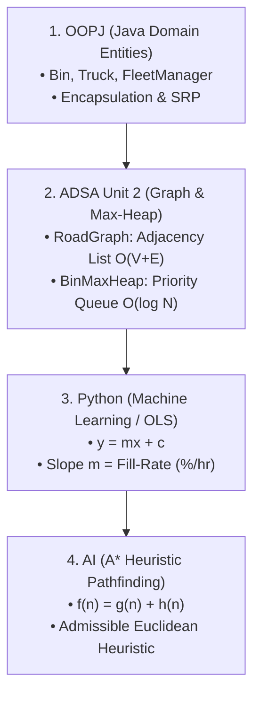

# 🎓 Next-Level Student Presentation & Learning Guide
## Smart Waste Collection Router (Team 10)

This comprehensive guide breaks down the entire project into simple, intuitive concepts so that **any student can understand, demonstrate, and defend it during academic vivas and presentations**.

---

## 📌 1. The Real-World Problem We Are Solving

In traditional municipal garbage collection:
- Municipal trucks follow a **fixed rigid route**, stopping at **every single waste bin** daily, regardless of whether a bin is 10% full or 90% full.
- **Consequences:**
  - 🚗 Huge wastage of diesel fuel driving to empty bins.
  - 🌍 Excess carbon dioxide ($\text{CO}_2$) emissions.
  - 🚦 Traffic congestion and unnecessary municipal budget expenditure.

### 💡 The Smart Waste Solution:
1. **IoT Smart Bins** monitor fill levels.
2. **Python Linear Regression** analyzes historical hourly readings and forecasts the exact **waste accumulation rate** ($m = \%/\text{hr}$).
3. **ADSA Binary Max-Heap** dynamically prioritizes bins with high urgency before they overflow.
4. **AI A\* Search Algorithm** plans the shortest road route visiting **only prioritized bins**, reducing route distance from 56 km to 33.9 km and saving **39.5% fuel**!

---

## 📚 2. Mapping to Academic Syllabi

| Subject | Source File | Core Academic Concept |
|---|---|---|
| **AI** | [`AStarRouter.java`](file:///c:/Users/haris/OneDrive/Desktop/smart%20waste%20collection%20router%20team-10/java/src/ai/AStarRouter.java) | **A\* Heuristic Search Algorithm** (`f = g + h`). Uses Euclidean straight-line distance as an admissible heuristic. |
| **ADSA (U2)** | [`RoadGraph.java`](file:///c:/Users/haris/OneDrive/Desktop/smart%20waste%20collection%20router%20team-10/java/src/adsa/RoadGraph.java) & [`BinMaxHeap.java`](file:///c:/Users/haris/OneDrive/Desktop/smart%20waste%20collection%20router%20team-10/java/src/adsa/BinMaxHeap.java) | 1. City Road Network represented as an **Adjacency List Graph** (`O(V + E)`). 2. Dynamic Urgency Queue built using a custom **Binary Max-Heap** (`O(log N)` heapify). |
| **OOPJ** | [`Bin.java`](file:///c:/Users/haris/OneDrive/Desktop/smart%20waste%20collection%20router%20team-10/java/src/model/Bin.java) & [`Truck.java`](file:///c:/Users/haris/OneDrive/Desktop/smart%20waste%20collection%20router%20team-10/java/src/model/Truck.java) & [`FleetManager.java`](file:///c:/Users/haris/OneDrive/Desktop/smart%20waste%20collection%20router%20team-10/java/src/oopj/FleetManager.java) | **Encapsulation**, **Composition**, and **Domain-Driven Design** protecting vehicle capacity and diesel logs. |
| **Python** | [`predictor.py`](file:///c:/Users/haris/OneDrive/Desktop/smart%20waste%20collection%20router%20team-10/python/predictor.py) | **Ordinary Least Squares (OLS) Linear Regression** (`y = mx + c`) predicting bin fill-rates. |

---

## 🎛️ 3. Next-Level Interactive Features in the Visual Dashboard

Open `http://localhost:8000` to access:
1. **Live Scenario Presets:**
   - 🌆 *Normal Day* (Baseline collection)
   - 🎪 *Market Rush* (Market & Mall bins accumulate trash 3x faster)
   - 🌧️ *Monsoon Flood* (Rain adds weight, suburb bins need emergency dispatch)
   - 🎓 *University Fest* (Campus food street overflowing)
2. **Interactive Live Bin Sandbox Slider:**
   - Select any bin and drag the fill slider from 10% to 100% to watch the Max-Heap, regression curve, and A* route re-calculate instantly in real time!
3. **Step-by-Step A\* Navigator:**
   - Step through the routing decision segment-by-segment with `⏮ Prev` and `Next ⏭` buttons.
4. **Interactive Student Quiz:**
   - Built-in 3-question viva check with instant scoring, feedback, and sound effects!
5. **Python OLS Regression Canvas:**
   - Live scatter plot of hourly readings, fitted regression line $y = mx + c$, slope, and $R^2$ score.
6. **SVG Binary Max-Heap Tree:**
   - Visual binary tree showing root extraction and heap structure.
7. **Municipal Audit Report Modal:**
   - Printable PDF dispatch certificate for viva presentation.

---

## 🚀 4. How to Run the Project

### 1-Click Batch Runner:
Double click [`run.bat`](file:///c:/Users/haris/OneDrive/Desktop/smart%20waste%20collection%20router%20team-10/run.bat). It automatically compiles the Java source code, runs the pipeline, and launches the browser dashboard.
